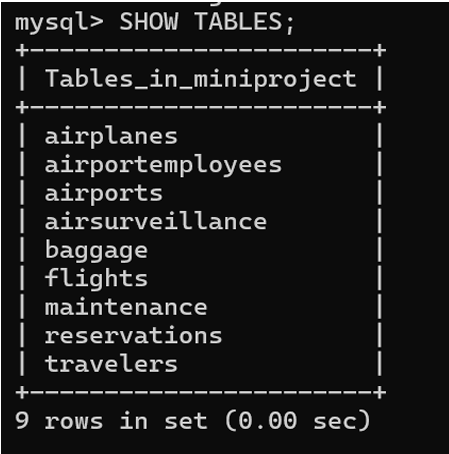
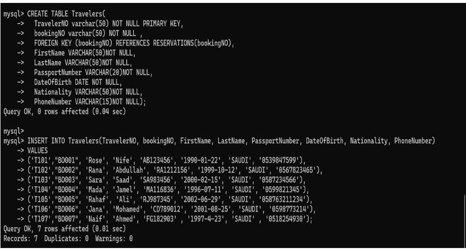
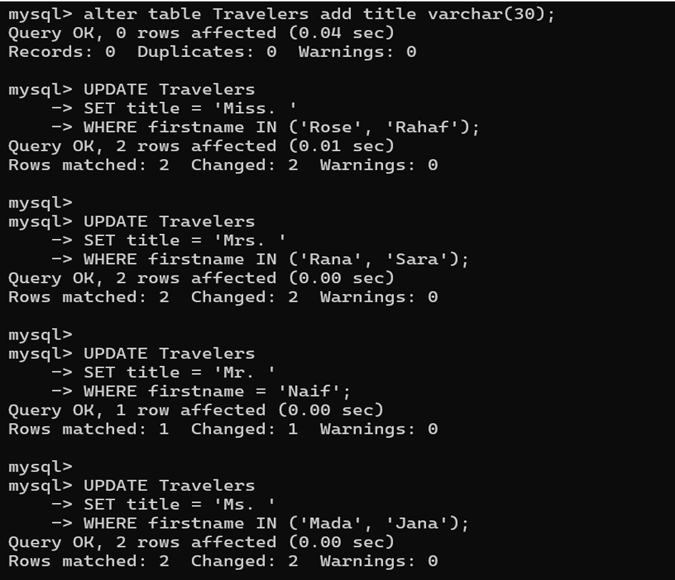
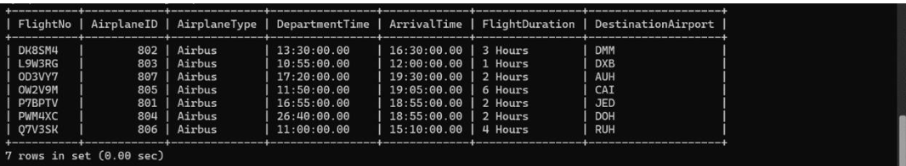

# ✈️ Airport Database Management System

  
  

---

##📌 Overview
This project is an Airport Database Management System designed to manage and organize airport operations efficiently, including flights, passengers, baggage, and employees.

### 📥 Project Resources
[📥 Click here to View or Download Full Project Documentation (PDF)](./Airport_Database_System_Documentation.pdf?raw=true)
---

## 🗄️ Database Architecture
The system is built on **9 relational tables - Airplanes
- Airports
- AirSurveillance
- Baggage
- Employees
- Flights
- Maintenance
- Reservations
- Travelers
**. Below is the high-level structure and the data implementation.

| Database Schema | Table List |
| :---: | :---: |
|  | *A list of all 9 entities integrated into the system.* |

---

## 💻 SQL Implementation & Logic
I focused on writing clean, efficient SQL scripts to handle data creation and complex updates.

### 🏗️ 1. Table Creation
Focused on **Primary Keys** and **Foreign Keys** to ensure seamless relationships.

### 🔄 2. Data Manipulation
Implemented logic for conditional updates, such as managing passenger titles and salaries.

---

## 📊 Final Results
The screenshot below shows the final output of a query retrieving flight details, proving the system is fully functional.

  

---

## 🛠️ Tech Stack & Skills
* **SQL Language:** MySQL
* **Relational Design:** Entity-Relationship Modeling
* **Data Analysis:** Complex Queries & Data Testing
* **Documentation:** Technical Reporting

---

  Developed with care by [Rahaf Al-Wadai] ✨

